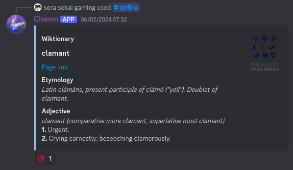

## Fina

Fina (*Fina Is Not an Administrator*) is a multi-purpose Discord bot developed in late 2021 and early 2022, written in Discord.js v13 (initially with v13-dev). Deployed as **Fina** (openly), **Slammer** (the Dead Cells Discord (formerly)) and **Charon** (the Arcaea Community Tounaments Discord). As the Dead Cells Discord bot, it was the successor/rewrite of **Hammer**, the bot which used to handle community feedback.

### Design

Fina was built exclusively with slash commands in mind (although context menus were added later, soon after their introduction), and features a robust framework for creating them, predating Discord.JS's command builder. New commands could be dropped into the `src/commands` directory and were independent from each other
(see [facepalm.ts](src/commands/misc/facepalm/Facepalm.ts) for the most basic example). Each command is supposed to send a response (wrapped in a nice embed by default), and any uncaught exception sends an ephemeral error embed instead.

Command list could be configured per-guild in the database (and with the rudimentary `/admin` command), predating Discord's built-in command permission system.

In contrast with traditional general-purpose Discord bots, Fina generally does not require any special Discord permissions, hence *Fina Is Not an Administrator*.

### Features

#### Polls

#### Games

Twenty questions, Rock-Paper-Scissors (with image generation); more were planned.

#### Tournament handling

Tournament automation for the mobile game Arcaea. Featured OCR for score fetching, although it was disabled in favor of official and officious APIs (which are all dead now).

#### Misc

Modmail, wiki scraping (including wiktionary), avatar and profile lookup, unit conversion, and many other such things.

### Archival

Development largely stopped in 2022 due to frustration with the way Discord and Discord.js were headed. Many problems Fina solved were solved later on in Discord.js v14, or within Discord itself (like polls). Since then I've mostly moved over to Matrix and haven't had motivation to continue working on a Discord "app".

No setup instructions are provided (maybe one day), and the code is uploaded mainly for archival/reference. It does not reflect my current TypeScript non-skill.

By the way, I also made a [music bot](https://github.com/wolftender/pantofel-v2).

### License

Code is AGPLv3.

Assets are from various sources (most of them are gitignored) and are uploaded as-is; probably don't copy them.